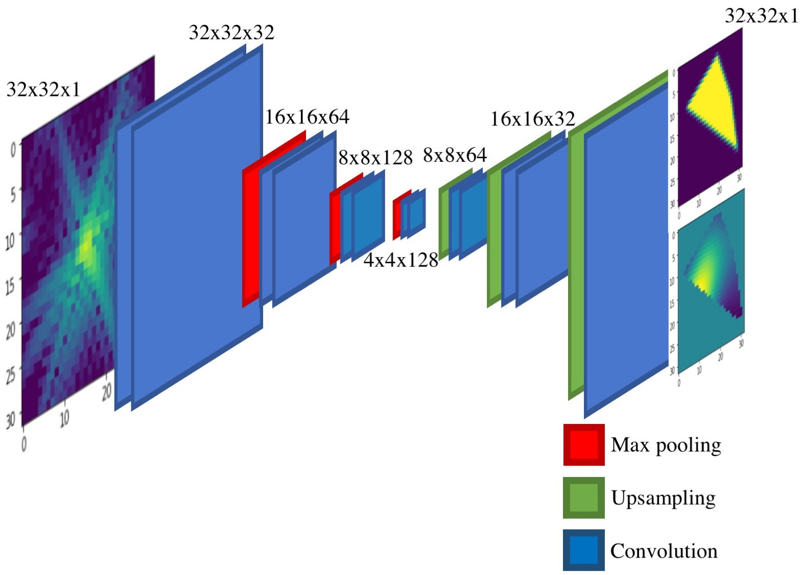

# CDI_NN
A pair of deep convolutional enoder-decoder networks that take 2D diffraction data and output the corresponding structure and phase

This is a companion page to the paper ["Real-time coherent diffraction inversion using deep generative networks"](https://www.nature.com/articles/s41598-018-34525-1)

Phase-retrieval or the iterative process of recovering lost phase information for measured intensities alone is an old problem that crops up in a variety of disciplines ranging from astronomy to X-ray, optical and electron microscopy. In the paper, we discuss the building, training and testing of a deep convolutional network that 

The strucuture of the network is shown below:

